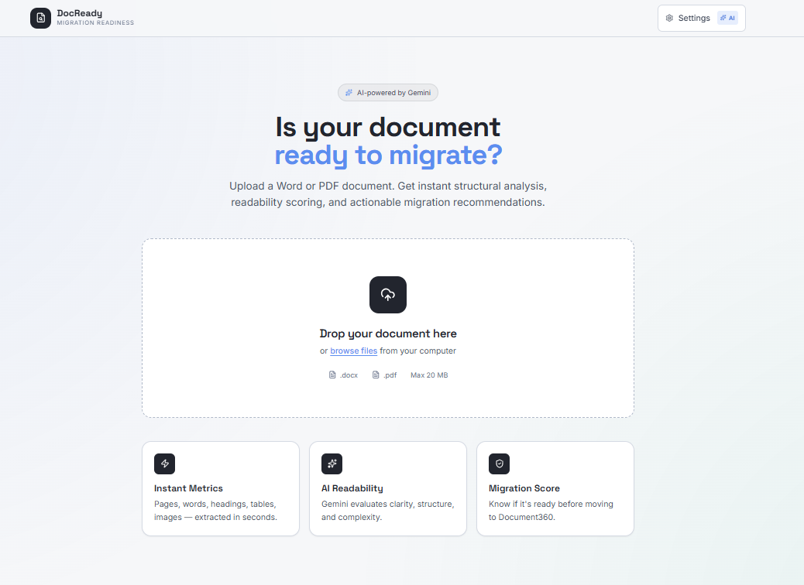
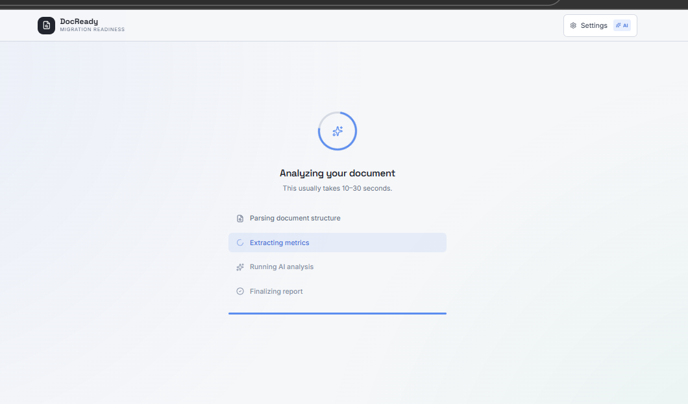
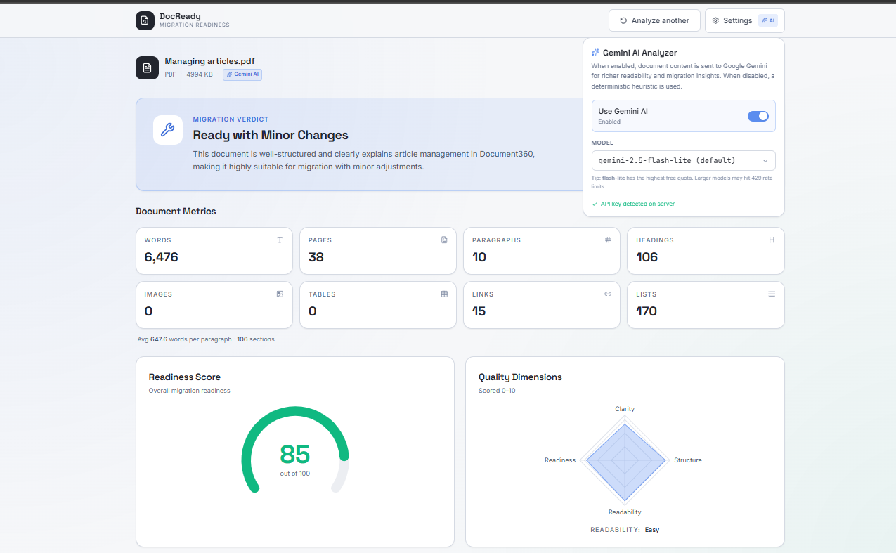
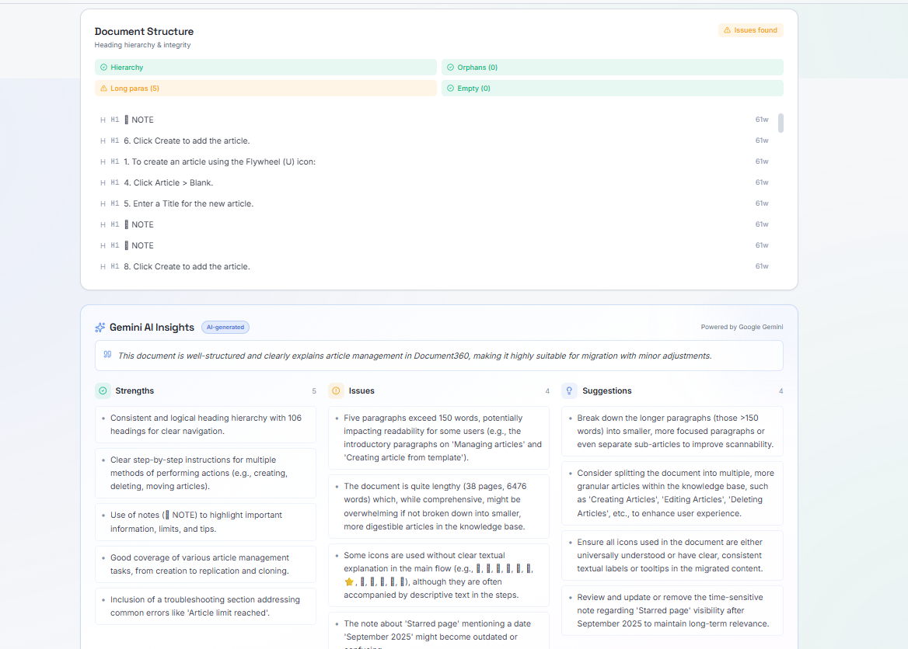
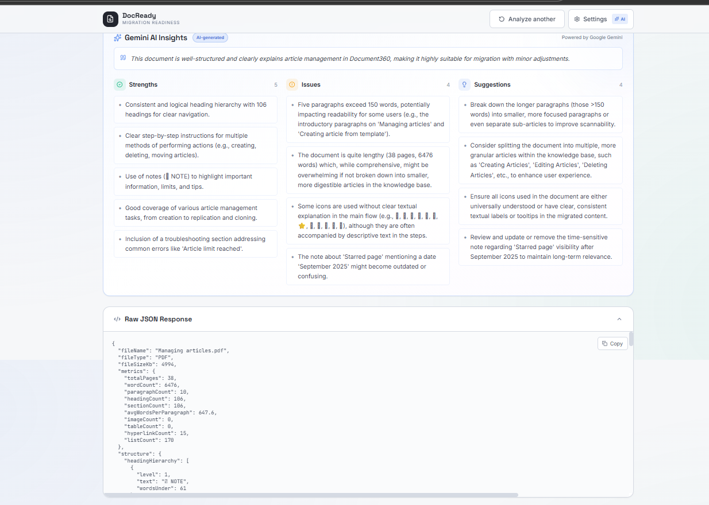

# DocReady — Document Analysis & Migration Readiness Tool

A full-stack tool that analyzes `.docx` and `.pdf` documents to evaluate their **readiness for migration** to a knowledge-base platform (e.g. Document360). It extracts structural metrics, evaluates readability with **Google Gemini AI**, and produces a structured verdict (`READY` / `READY_WITH_MINOR_CHANGES` / `NEEDS_RESTRUCTURING` / `NOT_READY`) — plus actionable strengths, issues, and suggestions.

> **Answers**: *"Is this document ready for migration? If not, what needs improvement?"*

---

##  Features

- **Multi-format parsing** — `.docx` (Apache POI) and `.pdf` (PDFBox)
- **Rich metrics** — pages, words, paragraphs, headings, avg-words/paragraph, images, tables, hyperlinks, lists
- **Structural analysis** — heading hierarchy consistency, orphan headings, long paragraphs detection
- **AI-driven analysis (Gemini)** — readability level, content clarity, structural quality, migration verdict, strengths, issues, suggestions
- **Heuristic fallback** — deterministic rule-based scoring when AI is disabled, rate-limited, or misconfigured
- **Per-request AI toggle + model picker** in the UI (persisted to localStorage)
- **Toast notifications** showing which model ran, or the exact reason a Gemini call fell back to heuristic
- **Polished React dashboard** — verdict banner, metrics grid, readiness gauge, readability chart, structure tree, AI insights, raw JSON viewer
- **JSON export** of the full analysis

---

## 📸 Screenshots

### Upload page
The clean entry point — drag-drop a `.docx` or `.pdf`, with a status pill showing whether AI or Heuristic mode is active.



### Loading screen
While the document is being parsed and analyzed, a progress screen shows live upload progress.



### Dashboard — verdict, metrics & Settings menu
Top of the dashboard with the migration verdict, document metrics, and the open **Settings menu** showing the **Gemini AI toggle** and the **model picker** (persisted to localStorage).



### Readiness score, quality dimensions & document structure
Visual breakdown — radial readiness gauge, a 4-axis radar of Clarity / Structure / Readability / Readiness, plus the heading-hierarchy tree with orphan & long-paragraph flags.



### Gemini AI Insights
Strengths, issues, and actionable suggestions generated by Gemini — visually distinct from the heuristic fallback (purple gradient + sparkles when AI-powered).



> Want to add your own screenshots? See [`docs/screenshots/README.md`](docs/screenshots/README.md).

---

## Architecture

```
┌─────────────────┐     POST /api/analyze     ┌──────────────────┐
│  React + Vite   │ ───────────────────────►  │  Spring Boot     │
│  (port 5173)    │                            │  (port 8080)     │
│                 │ ◄──── JSON response ────── │                  │
└─────────────────┘                            └────────┬─────────┘
                                                        │
                                              ┌─────────┼─────────┐
                                              ▼         ▼         ▼
                                          POI/PDFBox  Metrics  Gemini API
                                          (parse)    (compute) (analyze)
```

**Layered backend**: `Controller → Services (Parser, Metrics, Structure, Gemini) → Models`.

---

## 🛠 Tools & Libraries

### Backend (`/backend`)
| Library | Purpose |
|---|---|
| **Spring Boot 3.2.5** | REST API, DI, config |
| **Java 17** | Language |
| **Apache POI 5.2.5** | `.docx` parsing |
| **Apache PDFBox 3.0.2** | `.pdf` parsing |
| **Spring WebFlux (WebClient)** | Async HTTP calls to Gemini |
| **Lombok** | Boilerplate reduction |
| **Jackson** | JSON ser/de |

### Frontend (`/frontend`)
| Library | Purpose |
|---|---|
| **React 18 + Vite 5** | UI framework + dev server |
| **React Router 6** | Routing |
| **TailwindCSS 3** | Styling |
| **Axios** | HTTP client |
| **Recharts** | Readability bar chart |
| **lucide-react** | Icons |
| **react-hot-toast** | Toast notifications |

### AI
| Service | Default Model |
|---|---|
| **Google Gemini API** (`generativelanguage.googleapis.com`) | `gemini-2.5-flash-lite` (configurable in UI) |

---

##  Prerequisites

- **Java 17+** (`java -version`)
- **Maven 3.9+** (or use the bundled wrapper `./mvnw`)
- **Node.js 20.18+** and **npm 10+**
- **Google Gemini API key** (free tier works) — get one at https://aistudio.google.com/apikey

---

##  Setup & Run

### 1. Clone & enter the repo
```bash
git clone <repo-url>
cd AI_Parser
```

### 2. Set the Gemini API key
**Windows (PowerShell)** — for the current session:
```powershell
$env:GEMINI_API_KEY="YOUR_KEY_HERE"
```
**Persistent (per user)**:
```powershell
[Environment]::SetEnvironmentVariable("GEMINI_API_KEY","YOUR_KEY_HERE","User")
```
**macOS / Linux**:
```bash
export GEMINI_API_KEY="YOUR_KEY_HERE"
```

> If you skip this step the toggle in the UI will be greyed out and the tool will use the deterministic heuristic analyzer.

### 3. Start the backend
```bash
cd backend
mvn spring-boot:run
```
Server boots on **http://localhost:8080**. Verify:
```bash
curl http://localhost:8080/api/health
# {"status":"UP","service":"doc-migration-tool"}
```

### 4. Start the frontend (new terminal)
```bash
cd frontend
npm install
npm run dev
```
Open **http://localhost:5173**.

### 5. Use it
1. Drag-drop a `.docx` or `.pdf` (max 20 MB)
2. Click the **Settings** button in the navbar to toggle Gemini AI and pick a model
3. View the dashboard with verdict, metrics, AI insights
4. Click **Export JSON** to save the full analysis

---

##  REST API

### `GET /api/health`
```json
{ "status": "UP", "service": "doc-migration-tool" }
```

### `GET /api/settings`
```json
{
  "geminiConfigured": true,
  "geminiEnabledByDefault": true,
  "defaultModel": "gemini-2.5-flash-lite",
  "availableModels": [
    "gemini-2.5-flash-lite",
    "gemini-2.5-flash",
    "gemini-2.5-pro",
    "gemini-2.0-flash-lite",
    "gemini-2.0-flash",
    "gemini-flash-latest"
  ]
}
```

### `POST /api/analyze`
Multipart form upload.

| Param | Type | Required | Description |
|---|---|---|---|
| `file` | file | ✅ | `.docx` or `.pdf`, max 20 MB |
| `useAi` | boolean | ❌ | Override server default. `true` to call Gemini, `false` for heuristic |
| `model` | string | ❌ | One of `availableModels`. Defaults to `defaultModel` |

Sample:
```bash
curl -X POST "http://localhost:8080/api/analyze?useAi=true&model=gemini-2.5-flash-lite" \
  -F "file=@samples/input/sample.pdf"
```

Response → see [`samples/output/sample-output.json`](samples/output/sample-output.json).

---

##  Project Structure

```
AI_Parser/
├── backend/
│   ├── src/main/java/com/migration/tool/
│   │   ├── MigrationToolApplication.java
│   │   ├── config/        # GeminiConfig, WebConfig
│   │   ├── controller/    # AnalysisController
│   │   ├── exception/     # GlobalExceptionHandler
│   │   ├── model/         # AnalysisResponse, ParsedDocument, etc.
│   │   └── service/       # DocumentParserService, MetricsService,
│   │                      # StructureAnalysisService, GeminiAnalysisService
│   ├── src/main/resources/application.yml
│   └── pom.xml
├── frontend/
│   ├── src/
│   │   ├── api/                  # analysisApi.js
│   │   ├── components/           # Navbar, FileDropzone, MetricsGrid,
│   │   │                         # ReadinessGauge, SuggestionsList,
│   │   │                         # SettingsMenu, ExportButton, ...
│   │   ├── context/              # AnalysisContext, SettingsContext
│   │   ├── pages/                # UploadPage, DashboardPage
│   │   ├── App.jsx
│   │   ├── main.jsx
│   │   └── index.css
│   ├── tailwind.config.js
│   ├── vite.config.js
│   └── package.json
├── samples/
│   ├── input/           # example documents
│   └── output/          # corresponding JSON outputs
└── README.md
```

---

##  Configuration

Edit [`backend/src/main/resources/application.yml`](backend/src/main/resources/application.yml):

```yaml
gemini:
  api-key: ${GEMINI_API_KEY:}      # from env var
  model: gemini-2.5-flash-lite     # default model
  endpoint: https://generativelanguage.googleapis.com/v1beta/models
  enabled: true                    # default toggle state
  max-input-chars: 30000           # truncate document text before sending
  timeout-seconds: 60
  available-models:                # shown in UI dropdown
    - gemini-2.5-flash-lite
    - gemini-2.5-flash
    - gemini-2.5-pro
    - gemini-2.0-flash-lite
    - gemini-2.0-flash
    - gemini-flash-latest
```

---

##  Sample Output

See [`samples/output/sample-output.json`](samples/output/sample-output.json) for a complete response. Key fields:

```jsonc
{
  "fileName": "sample.pdf",
  "fileType": "pdf",
  "fileSizeKb": 307,
  "metrics": {
    "totalPages": 17,
    "wordCount": 1849,
    "paragraphCount": 38,
    "headingCount": 98,
    "avgWordsPerParagraph": 48.7,
    "imageCount": 1, "tableCount": 0, "hyperlinkCount": 0
  },
  "structure": {
    "hasConsistentHierarchy": true,
    "longParagraphs": 0,
    "orphanHeadings": []
  },
  "aiAnalysis": {
    "readabilityLevel": "Medium",
    "contentClarity": 8.0,
    "structuralQuality": 8.5,
    "migrationReadiness": "READY_WITH_MINOR_CHANGES",
    "readinessScore": 82,
    "summary": "Well-structured document, suitable for migration with minor edits.",
    "strengths": ["Clear headings", "Logical hierarchy"],
    "issues": ["Some sections could use more examples"],
    "suggestions": ["Add a glossary", "Split long sections into subsections"]
  },
  "verdict": {
    "isReadyForMigration": true,
    "confidence": 0.82,
    "oneLineSummary": "Ready with minor changes."
  },
  "analyzer": "gemini",
  "model": "gemini-2.5-flash-lite"
}
```

---

##  Edge Cases Handled

- **Empty file** → 400 with clear error message
- **Unsupported file type** → rejected before parsing
- **Large documents** → AI input is truncated to `max-input-chars`; metrics still computed on full text
- **Inconsistent headings** → flagged in `structure.hasConsistentHierarchy = false` and surfaced in issues
- **Gemini quota / network failure** → automatic heuristic fallback; UI shows red toast + "Heuristic Insights" panel with the exact reason (e.g. *"Gemini quota exceeded (HTTP 429)"*)
- **Missing API key** → toggle in UI is disabled with clear "API key not configured" status

---

##  Troubleshooting

| Symptom | Cause / Fix |
|---|---|
| Settings toggle is greyed out | `GEMINI_API_KEY` not set; restart backend after exporting the env var |
| Toast: *"Model X failed — using heuristic"* | Quota (429) or model unavailable. Switch model in Settings (try `flash-lite`) |
| `404 Not Found` from Gemini | Model name is invalid for your key. Check `/api/settings` for `availableModels` |
| Vite fails with "requires Node 20.19+" | You're on older Node. Either upgrade or `npm i -D vite@5 @vitejs/plugin-react@4` |
| `mvn` not found | Use the bundled wrapper: `./mvnw spring-boot:run` (or `mvnw.cmd` on Windows) |

---

##  License

For evaluation / take-home assignment purposes.
